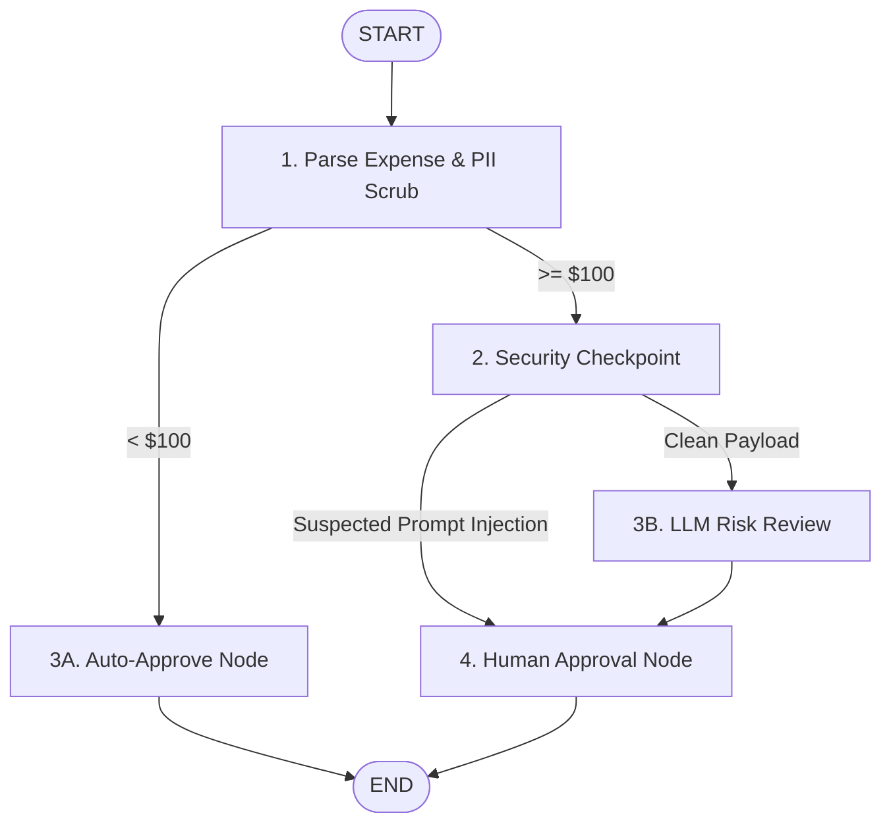

# 5-Day AI Agents Intensive: Day 4 Workspace

Welcome to the Day 4 workspace of the **5-Day AI Agents: Intensive Vibe Coding Course with Google**. 

This repository details the work done on Day 4, featuring a secure, production-ready, graph-based agent workflow built with **Google ADK 2.0** for **Ambient Expense Approval with Security Controls**.

---

## 📂 Project Structure

```
├── ambient-expense-agent/     # Core graph-based expense agent project
│   ├── app/                   # FastAPI backend server configuration
│   │   ├── agent.py           # Entrypoint importing the expense_agent package
│   │   └── fast_api_app.py    # Backend server exposing the endpoint
│   ├── expense_agent/         # Primary application logic package
│   │   ├── agent.py           # Graph workflow, PII scrubbing, injection defense
│   │   ├── config.py          # Port, model, and approval threshold settings
│   │   └── schemas.py         # Pydantic schemas (ExpenseReport, RiskReview, etc.)
│   ├── tests/                 # Integration and unit tests
│   ├── pyproject.toml         # uv project configuration
│   └── uv.lock                # Lockfile for reproducible dependencies
├── .gitignore                 # Excludes environments, caches, and key files
└── README.md                  # This documentation
```

---

## 🛡️ Secure Ambient Expense Approval Flow
This agent utilizes a graph-based workflow containing prompt injection defense, multi-pass PII redaction, auto-approvals, LLM evaluations, and **Human-in-the-Loop (HITL)** reviews.

### 🔄 The Workflow Graph Architecture


### ⚙️ Core Components:
1. **PII Scrubbing**: Automatically parses input payloads (supporting standard JSON and Base64 Pub/Sub streams) and redacts sensitive PII (Social Security Numbers and Credit Card numbers) *before* passing the text to the LLM.
2. **Prompt Injection Defense**: Evaluates descriptions against prompt injection patterns (such as instruction overrides, system policy bypass attempts, and forced approvals). If flagged, it **bypasses the LLM completely** and routes the event directly to a Human Review node to defend systemic prompt integrity.
3. **Threshold Auto-Approval**: Instantly auto-approves low-value expenses under $100 (configurable via `config.py`) without invoking LLMs, saving operational overhead and API costs.
4. **LLM Risk Review**: For clean, high-value expenses (>= $100), `gemini-3.6-flash` performs a risk evaluation to produce structured assessments (risk level, risk factors, recommended actions, alert summaries).
5. **Human-in-the-Loop (HITL) Interrupts**: Utilizes ADK 2.0 `RequestInput` checkpoints to securely pause the workflow, requesting manual input (`approve` or `reject`) from human administrators before finalization.

---

## 🚀 Getting Started

### Prerequisites
Make sure you have `uv` installed (or your preferred Python package manager) and a valid Gemini API Key configured in your environment.

### Setup and Running the Agent
1. Navigate to the agent directory:
   ```bash
   cd ambient-expense-agent
   ```
2. Set up your local environment file:
   ```bash
   cp .env.example .env
   # Set your GEMINI_API_KEY inside the .env file
   ```
3. Initialize dependencies:
   ```bash
   uv run google-agents-cli install
   ```
4. Start the development playground:
   ```bash
   uv run google-agents-cli playground
   ```

### Running Tests
Execute unit and integration tests:
```bash
uv run pytest tests/unit tests/integration
```

---

## 🔒 Security Scan & Git Config
- A root [`.gitignore`](./.gitignore) has been created to prevent committing virtual environments (`.venv`), cached files (`__pycache__`, `.pytest_cache`), and local configurations (`.env`).
- A security audit has been performed on the codebase to ensure no secrets or API keys are hardcoded in the committed files.
